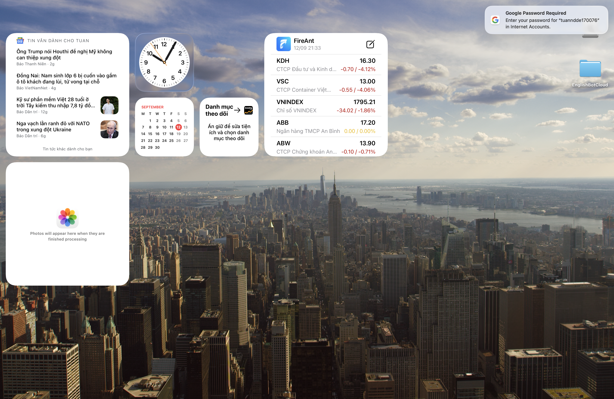

# TOEIC Learn: Project Progress & Cross-Session Memory Ledger

Tài liệu này đóng vai trò là **Bộ Nhớ Chuyển Giao (Session Memory Ledger)** cho các AI Agent và lập trình viên giữa các session làm việc độc lập. Mọi session mới khi bắt đầu **BẮT BUỘC ĐỌC FILE NÀY** để nắm bắt toàn bộ ngữ cảnh, kiến trúc và tiến độ hiện tại mà không cần hỏi lại người dùng.

---

## 🏛️ Quy Tắc Kiến Trúc & Bất Biến (Architectural Invariants)

1. **NO UI EMOJIS (STRICT)**:
   - Tuyệt đối không đưa các emoji (🎯, 🤖, 🚀, 💡, 🎧, 📝, ➔, 🧹, 👁️, 💪, 🎉, ⏳, v.v.) vào các thành phần giao diện, nút bấm, huy hiệu (badges), tiêu đề, hoặc văn bản hiển thị cho người dùng.
   - Luôn sử dụng icon SVG sạch, chuyên nghiệp từ `@/components/icons/AppIcons`.
2. **Type Safety**:
   - Mọi thay đổi phải đảm bảo `npx tsc --noEmit` đạt 0 lỗi biên dịch.
3. **Non-Destructive Data Preservation**:
   - Khi cập nhật lộ trình học (Study Plan), không bao giờ xóa hoặc thay đổi các ngày học (`day.completed === true`) và nhiệm vụ (`task.completed === true`) mà người học đã hoàn thành. Chỉ tái cấu trúc các ngày/nhiệm vụ trong tương lai.
4. **Chu trình sản phẩm lý tưởng (Ideal Product Loop)**:
   - **Diagnose → Learn → Practice → Measure → Identify Weakness → Recommend → Practice Again**.
   - Mọi tính năng mới phải bám sát chu trình này để giúp người học tăng điểm thực chất.

---

## 📌 Lịch Sử Các Vấn Đề Đã Giải Quyết (Milestones 1 - 6)

### ✅ Vấn đề 1: Khởi tạo & Cấu trúc Dự án Cơ bản
* Thiết lập Next.js App Router, Tailwind/CSS modules, SQLite Prisma ORM, và hệ thống Auth cơ bản.

### ✅ Vấn đề 2: Dữ liệu Đề thi ETS Thực Tế & Giao diện Chuẩn ETS
* **Mô tả**: Dữ liệu đề thi ETS thực tế ban đầu còn mỏng và thiếu tính xác thực.
* **Giải pháp**:
  * Tích hợp đầy đủ bộ đề ETS chuẩn format (`ETS 2022 Test 1` và `ETS 2022 Test 2`) gồm 200 câu hỏi mỗi đề, phân chia chuẩn từ Part 1 đến Part 7.
  * Tích hợp trình phát âm thanh `ListeningAudioPlayer` cho LC (Part 1-4) và giao diện chia đôi (Split View) cho RC (Part 6-7).
  * Xây dựng chế độ Review toàn diện (lọc xem riêng các câu sai, đáp án đúng và lời giải chi tiết).

### ✅ Vấn đề 3: Phân tích Lỗi sai Bóc tách theo Sub-skill / Chủ điểm Ngữ pháp
* **Mô tả**: Báo cáo trước đây chỉ dừng ở mức Part (ví dụ: "Bạn yếu Part 5"), chưa chỉ ra người học sai vì ngữ pháp gì.
* **Giải pháp**:
  * Gắn tag phân loại `subCategory` và `grammarTag` chi tiết cho toàn bộ ngân hàng Part 5 & Part 6:
    * *Từ loại (Word Form)*
    * *Thì & Thể động từ (Verb Tense)*
    * *Giới từ & Liên từ (Preposition & Conjunction)*
    * *Mệnh đề quan hệ (Relative Clauses)*
    * *Đại từ (Pronoun)*
    * *Từ vựng công sở (Business Vocabulary)*
    * *Cấu trúc câu (Sentence Structure)*
  * Xây dựng component `GrammarRadarChart.tsx` trên trang Thống kê (`/stats`) hiển thị trực quan biểu đồ radar lỗ hổng kiến thức.

### ✅ Vấn đề 4: Dung lượng Kho Từ vựng Cốt lõi & Spaced Repetition
* **Mô tả**: Kho từ vựng ban đầu chỉ có 34 từ mẫu, chưa đủ độ phủ cho các band điểm mục tiêu.
* **Giải pháp**:
  * Mở rộng ngân hàng từ vựng lên **hơn 400 từ vựng TOEIC tần suất cao**, phân chia theo 3 band điểm rõ ràng:
    * **Target 450+**: 100+ từ vựng nền tảng công sở hàng ngày.
    * **Target 650+**: 150+ từ vựng giao tiếp thương mại & hợp đồng.
    * **Target 800+**: 150+ từ vựng nâng cao chuyên sâu về tài chính, luật và quản trị.
  * Kết nối đầy đủ vào thuật toán học lặp lại ngắt quãng (Leitner Spaced Repetition Box 1-5).

### ✅ Vấn đề 5: Chế độ Luyện tập Chuyên sâu theo Chủ điểm Ngữ pháp (Targeted Sub-skill Mode)
* **Mô tả**: Người học thấy điểm yếu trên biểu đồ Radar nhưng không có công cụ luyện tập tập trung vào đúng chủ điểm đó.
* **Giải pháp**:
  * Xây dựng chế độ luyện tập Part 5 hỗ trợ query parameter `?subCategory=...`.
  * **Cross-test Pooling**: Hệ thống tự động gom câu hỏi của chủ điểm đó từ tất cả các đề ETS có sẵn (ví dụ: gom 17 câu *Từ loại* hoặc 19 câu *Từ vựng công sở* liên đề).
  * Tích hợp thanh chọn chủ điểm (Sub-skill Pill Selector) và kết nối 1-click trực tiếp từ Biểu đồ Radar (`/stats`) và Sổ tay câu hỏi sai (`/notebook`).

### ✅ Vấn đề 6: Lộ trình Học (Study Plan) Tự động Đồng bộ Thích ứng từ Kết quả Chẩn đoán & Lỗi sai
* **Mô tả**: Lộ trình học và widget "Mục tiêu Vàng hôm nay" trên Dashboard hoạt động biệt lập theo cấu hình ban đầu, không tự thích ứng khi người học làm bài test chẩn đoán, thi thử full test hoặc làm sai câu hỏi.
* **Giải pháp**:
  * Xây dựng `analyzeLearnerGaps()` và `rebalanceStudyPlan(plan, gaps)` trong `src/utils/studyPlanEngine.ts`.
  * Tự động nhận diện điểm số mới nhất, Part yếu nhất, và top lỗi ngữ pháp sai nhiều nhất trong Sổ tay lỗi sai.
  * Tái cân bằng các ngày học trong tương lai: tự động gán bài luyện chuyên sâu Part 5 theo đúng chủ điểm yếu (e.g. `Luyện Part 5: Chuyên đề Word Form [WORD FORM]` kèm link `/part5?subCategory=Word%20Form`) và tự động nhắc nhở số lượng câu hỏi đến hạn ôn tập trong Sổ tay (`filter=due`).
  * Bổ sung **Adaptive Sync Banner** trên `/study-plan` với nút 1-Click `"Đồng bộ theo lỗi sai mới"`.
  * Tự động kích hoạt đồng bộ ngầm khi người học nộp bài Test Chẩn đoán (`/diagnostic`) hoặc nộp bài Thi thử ETS 200 câu (`/exam`).
  * Dashboard hiển thị trực tiếp nhãn chuyên đề và nút "HỌC NGAY" chuyển thẳng vào bài tập chuyên sâu.

### ✅ Vấn đề 7: Báo cáo sau Thi thử (Exam & Mini-test) Bóc tách Lỗ hổng Kiến thức (Knowledge Gap Breakdown)
* **Mô tả**:
  * Trước đây, màn hình kết quả sau khi thi thử tại `/exam` chỉ hiển thị điểm tổng và tỷ lệ đúng chung chung theo từng Part (Part 1 - 7), người học không biết mình sai vì lỗ hổng ngữ pháp cụ thể nào.
  * Màn hình `/mini-test` chỉ hiện tổng số câu đúng mà không có bóc tách Part 2 vs Part 5 và không có phân tích chuyên đề.
  * Đứt gãy chu trình học tập vì thiếu cầu nối 1-click để người học lập tức luyện tập khắc phục ngay chủ điểm yếu vừa phát hiện.
* **Giải pháp**:
  * Xây dựng component trung tâm `KnowledgeGapBreakdown.tsx` và `KnowledgeGapBreakdown.module.css`:
    * **Thẻ Lỗ hổng Cần Ưu Tiên Khắc Phục Gấp**: Tự động xếp hạng top 1 - 3 chủ điểm yếu nhất từ bài làm kèm lời khuyên chiến thuật (Strategy Tip) và nút 1-click `Luyện chuyên đề [Tên chuyên đề] ngay` (`/part5?subCategory=...`).
    * **Bảng Bóc Tách Chi Tiết Toàn Bộ Chủ Điểm**: Thống kê số câu đúng/tổng câu, thanh progress bar trực quan đổi màu, nhãn đánh giá mức độ (*Lỗ hổng nghiêm trọng*, *Cần củng cố*, *Thành thạo*) và nút `Luyện tập ->`.
    * **Bóc Tách Kỹ Năng Part 2 vs Part 5**: Tích hợp riêng cho Mini-test so sánh trực quan giữa Phản xạ Nghe Hỏi - Đáp và Ngữ pháp.
    * **Khép kín Chu trình Học tập**: Nút chuyển tiếp nhanh sang *Lộ trình thích ứng đã tối ưu*, *Sổ tay câu hỏi sai*, và *Luyện tập chuyên đề*.
  * Tích hợp đồng bộ ngầm `syncAdaptivePlan()` ngay khi nộp bài Mini-test.
  * Loại bỏ emoji `⏳` trong `mini-test/page.tsx`, tuân thủ triệt để nguyên tắc **NO UI EMOJIS (STRICT)**.

### ✅ Vấn đề 8: Kho Chiến thuật & Mẹo thi (TOEIC Strategies & Traps) Toàn Diện 30 Chuyên Đề
* **Mô tả**:
  * Trước đây kho mẹo chỉ có 6-7 mẹo mẫu sơ sài, thiếu hoàn toàn Part 4 và Part 6, không có phân loại bẫy thi ETS kinh điển (Traps) và giao diện `/tips` chỉ có 3 tab cơ bản, không có lọc theo Part hay Band điểm mục tiêu.
* **Giải pháp**:
  * Mở rộng `src/data/strategies.ts` lên **30 chiến thuật & bẫy đề thi chuẩn ETS** phủ đều cả 7 Part (Part 1 - 7) và chiến thuật phòng thi tổng quát, phân chia theo 3 Band điểm (450+, 650+, 800+).
  * Nâng cấp cấu trúc dữ liệu `ToeicTip` với: `trapWarning` (Cảnh báo bẫy ETS), `ruleFormula` (Quy tắc vàng), `examples` (Phân tích phương án Sai vs Đúng), `tags` và `practiceLink` (Liên kết thực hành 1-click).
  * Thiết kế lại giao diện `/tips` và `page.module.css`:
    * Bộ lọc 3 chiều: Phần thi (Part 1-7, General), Phân loại (Bẫy đề thi, Chiến thuật, Ngữ pháp), Mục tiêu điểm (450+, 650+, 800+).
    * Thanh tìm kiếm tức thì theo từ khóa, bẫy, công thức.
    * Thẻ hiển thị chuyên nghiệp với hộp Cảnh báo bẫy đỏ, hộp Quy tắc vàng, ví dụ thực chiến và nút 1-click `Áp dụng vào bài luyện ngay`.
    * Tuân thủ 100% nguyên tắc **NO UI EMOJIS (STRICT)** với SVG icons từ `AppIcons`.

### ✅ Vấn đề 9: Phần Luyện Nghe (Part 1 - 4) với Chế Độ Nghe Chép Chính Tả (Dictation) & Lời Thoại Tương Tác (Interactive Transcript)
* **Mô tả**:
  * Trước đây, người học luyện nghe Part 1 - 4 chỉ có thể làm trắc nghiệm đơn thuần, dẫn đến "ảo tưởng nghe hiểu" (passive listening) khi không bắt được hiện tượng nối âm, nuốt âm, từ nối hay âm đuôi.
  * Transcript chỉ là một đoạn văn bản HTML thô, không có lượt thoại, không nghe lại được từng câu riêng biệt. Part 2 chỉ có ô textarea tạm bợ không chấm điểm từ vựng; Part 1, Part 3, Part 4 hoàn toàn thiếu tính năng chép chính tả.
* **Giải pháp**:
  * Xây dựng module xử lý ngôn ngữ & âm học `src/utils/transcriptParser.ts`:
    * `parseTranscript`: Bóc tách HTML thô chuẩn ETS thành mảng lượt thoại có cấu trúc `TranscriptLine[]` (Lựa chọn A-D của Part 1, Câu hỏi & Đáp án của Part 2, Đối thoại W/M của Part 3, Câu độc thoại của Part 4) kèm nhãn đáp án đúng.
    * `diffWords`: Giải thuật so khớp từ vựng (Tokenized Word Diffing) client-side tính tỷ lệ chính xác `%`, phân loại từ đúng (xanh), từ sai/lỗi chính tả (gạch đỏ), từ bỏ sót (cam).
    * `generateClozeBlanks`: Thuật toán sinh chỗ trống thông minh che các từ khóa (content words) cho chế độ điền từ.
    * `speakSentence`: Tích hợp phát âm chuẩn Web Speech API (0kb bundle, 0 latency).
  * Xây dựng component `DictationTrainer.tsx` & `DictationTrainer.module.css`:
    * Hai chế độ chuyên sâu: **Điền từ khuyết (Cloze)** và **Chép trọn vẹn câu (Full Dictation)**.
    * Nút "Gợi ý chữ cái đầu" / "Gợi ý 3 từ đầu", "Hiện đáp án", "Nghe câu này", và "Kiểm tra chính tả".
    * Thanh điều hướng từng câu thoại (`Câu 1 / 4`, Câu trước, Câu tiếp theo).
    * Tích hợp âm thanh tích cực `soundEffects.playCorrect()` khi đạt >= 80%.
  * Xây dựng component `InteractiveTranscript.tsx` & `InteractiveTranscript.module.css`:
    * Hiển thị kịch bản nghe chuẩn format với badge người nói, gắn nhãn xanh `Đáp án đúng`.
    * Tích hợp nút loa phát âm từng câu và click từng từ để nghe phát âm từ vựng đơn lẻ.
    * Nút 1-click `Chép chính tả bài này` chuyển ngay sang DictationTrainer.
  * Tích hợp bộ chuyển đổi 3 chế độ (`Làm bài ETS` | `Chép chính tả` | `Lời thoại tương tác`) trên toàn bộ 4 phần nghe (`/part1`, `/part2`, `/part3`, `/part4`).
  * Tuân thủ 100% nguyên tắc **NO UI EMOJIS (STRICT)** với SVG icons sạch từ `AppIcons`.

---

### ✅ Vấn đề 10: Bóc tách Dạng câu hỏi & Luyện chuyên sâu Part 7 (Targeted Reading Practice)
* **Mô tả**:
  * Trước đây, Part 7 Reading Comprehension là "hộp đen" lớn nhất của bài thi: không có gắn nhãn dạng câu hỏi, người học chỉ có thể làm lần lượt từng bài đọc theo đề mà không thể luyện tập tập trung vào dạng câu hỏi mình hay sai.
  * Toàn bộ 15 set bài đọc của Test 1 đều bị gán nhầm là "Single Passage" (trong khi câu 176-185 là Đoạn đôi và câu 186-200 là Đoạn ba).
  * Thiếu đo lường nhịp độ (Pacing Analysis: giây/câu) khiến người học dễ bị "cháy giờ" mà không được cảnh báo.
  * Báo cáo lỗ hổng sau thi (`KnowledgeGapBreakdown`), Sổ tay lỗi sai và Lộ trình thích ứng chưa bóc tách được các dạng bài Part 7.
* **Giải pháp**:
  * Chuẩn hóa Schema `Part7QuestionSchema` trong `src/schema/toeic.ts` bổ sung `questionType`, `subCategory`, `strategyHint`.
  * Chuẩn hóa toàn diện 108 câu hỏi Part 7 (54 câu Test 1 + 54 câu Test 2) theo 6 Dạng câu hỏi chuẩn ETS:
    * *Main Idea & Purpose (Ý chính & Mục đích bài đọc)*
    * *Detail & Factual (Thông tin chi tiết)*
    * *Inference & Suggestion (Suy luận ngụ ý)*
    * *NOT / TRUE (Thông tin Sai / Đúng)*
    * *Vocabulary in Context (Từ vựng ngữ cảnh)*
    * *Sentence Placement & Intent (Điền câu & Ý đồ lời nói)*
  * Sửa lỗi cấu trúc bài đọc trong Test 1: 10 Đoạn đơn (Q147-175), 2 Đoạn đôi (Q176-185), và 3 Đoạn ba (Q186-200).
  * Nâng cấp giao diện `/part7` với **Targeted Reading Filter Bar & Không gian đọc tối ưu**:
    * Thanh lọc dạng câu hỏi và cấu trúc đoạn văn dạng Pills mượt mà, hỗ trợ chế độ thu gọn (`Đổi bộ lọc` / `Thu gọn`) tiết kiệm 120px+ chiều dọc.
    * Khắc phục triệt để lỗi "bị che đề / tràn thẻ": Tách `card-minimal`, cấu hình `flex-shrink: 0`, `overflow-y: auto` với scrollbar thanh mảnh cho cả 2 cột (Passage và Question), hiển thị 100% câu hỏi, 4 phương án A-B-C-D và các nút điều hướng rõ ràng, không bị cấn chân trang.
    * Hỗ trợ Cross-test pooling (Gom liên đề Test 1 + Test 2 = 30 bài đọc phong phú).
    * Hiển thị nhãn Badge chuyên nghiệp trên từng câu hỏi (`[Inference]`, `[Detail]`, v.v.).
    * Hộp mẹo giải nhanh ETS (`LightbulbIcon`) hiển thị ngay khi xem giải thích chi tiết.
  * Tích hợp **Pacing Indicator (Đo lường nhịp độ làm bài)**:
    * Tự động đo lường thời gian giải quyết từng bài đọc theo giây/câu.
    * Hiển thị Chip nhịp độ: Chuẩn ETS (<60s/câu, xanh lá), Vừa phải (60-90s/câu, vàng), Cảnh báo chậm (>90s/câu, đỏ).
  * Kết nối khép kín chu trình học tập:
    * Khi làm sai câu hỏi Part 7, `addMistake` tự động lưu `subCategory: q.questionType` vào Sổ tay lỗi sai.
    * Màn hình tổng kết Part 7 bóc tách độ chính xác theo từng dạng bài và có nút 1-click `Luyện riêng dạng này`.
    * Báo cáo lỗ hổng sau thi (`KnowledgeGapBreakdown.tsx`) bổ sung nhóm **Bóc tách Kỹ năng Đọc hiểu Part 7** kèm lời khuyên chiến thuật và link 1-click đến `/part7?questionType=...`.
    * Lộ trình học thích ứng (`studyPlanEngine.ts`) tự động nhận diện điểm yếu đọc hiểu để sinh nhiệm vụ: `Luyện Part 7: Dạng câu hỏi [Tên dạng]`.
  * Tuân thủ 100% nguyên tắc **NO UI EMOJIS (STRICT)** với SVG icons sạch từ `AppIcons`.

---

---

### ✅ Vấn đề 11: Hệ thống Phân tích Nhịp độ Đọc hiểu Part 7 Toàn diện & Tích hợp Thi thử (Full Pacing Analytics & Exam Integration)
* **Mô tả**:
  * Trước đây, người học Part 7 thiếu hệ thống kiểm soát thời gian chuẩn ETS theo cấu trúc từng bài đọc (Single vs Double vs Triple Passages).
  * Trong bài thi thử full 200 câu (`/exam`), hệ thống không ghi nhận và bóc tách thời gian thực tế đã dùng cho Part 7 (Q147 - 200), khiến người học không biết mình có bị "cháy giờ" (vượt quá 54 phút chuẩn ETS) hay không.
  * Thiếu liên kết bóc tách dạng câu hỏi Part 7 trong bài thi Full Test vào bảng `KnowledgeGapBreakdown`.
* **Giải pháp**:
  * **Huy hiệu Nhịp độ Đề xuất ETS Thời gian thực (Live Target Pacing Badge)**:
    * Tự động tính toán chuẩn thời gian khuyến nghị chuẩn ETS trên header `/part7` theo cấu trúc:
      * *Đoạn đơn (Single)*: < 50s / câu
      * *Đoạn đôi (Double)*: < 60s / câu (5 câu / 5 phút)
      * *Đoạn ba (Triple)*: < 75s / câu (5 câu / 6 - 6.5 phút)
    * Hiển thị gọn gàng trên header: `Mục tiêu ETS: < X phút (Y câu)` với `ClockIcon`.
  * **Báo cáo Phân tích Nhịp độ Toàn phiên (Session Pacing Analytics Card)**:
    * Tích lũy `sessionPacingHistory` cho từng bài đọc trong phiên luyện tập.
    * Trên màn hình kết quả `/part7`, hiển thị thẻ Báo cáo Phân tích Nhịp độ Đọc hiểu:
      * Tốc độ đọc trung bình phiên (giây/câu) kèm tổng thời gian hoàn thành.
      * Trạng thái nhịp độ: Tốc độ vàng ETS (<= 60s/câu, xanh lá), Cần tăng tốc nhẹ (61 - 80s/câu, vàng), Nguy cơ cháy giờ cao (> 80s/câu, đỏ).
      * Phân tích đối sánh thực tế vs chuẩn ETS theo từng cấu trúc (Đoạn đơn vs Đoạn đôi vs Đoạn ba).
      * Lời khuyên phân bổ thời gian chiến thuật cá nhân hóa (Pacing Action Advice).
  * **Đo lường & Phân tích Thời gian Part 7 trong Bài Thi Thử Full Test 200 câu (`/exam`)**:
    * Gắn tag `subCategory` và `grammarTag` chuẩn 6 dạng bài đọc cho toàn bộ câu hỏi 147 - 200 khi nạp bài thi.
    * Tích lũy thời gian thực tế người học lưu lại tại Part 7 trong 120 phút thi thử.
    * Trên màn hình kết quả thi thử 200 câu, hiển thị **Thẻ Phân tích Nhịp độ & Thời gian Part 7**:
      * Thời gian đã làm (phút giây) so sánh với chuẩn ETS (<= 54 phút).
      * Tốc độ trung bình (giây/câu) so với mục tiêu (<= 60s/câu).
      * Đánh giá nguy cơ cháy giờ và lời khuyên chiến thuật phân bổ thời gian cho bài thi thật.
      * Kết nối đồng bộ với Báo cáo Lỗ hổng Kiến thức (`KnowledgeGapBreakdown`) hiển thị toàn bộ dạng đọc hiểu Part 7.
  * **Chất lượng & Tiêu chuẩn**:
    * Tuân thủ tuyệt đối quy tắc **NO UI EMOJIS (STRICT)**: 0 emojis, 100% SVG icons từ `AppIcons`.
    * Đạt 100% kiểm thử tự động E2E: `scratch/test_part7_full_pacing_e2e.mjs`.
    * Không gây hồi quy các tính năng cũ (Regression tests passed 100%).

---

### ✅ Vấn đề 12: Gắn nhãn nguyên nhân sai (Root-Cause Tagging) trong Sổ tay
* **Mô tả**: Sổ tay lỗi sai trước đây chỉ báo cho người dùng biết họ đã làm sai câu nào và sai bao nhiêu lần, nhưng thiếu cơ chế giúp họ tự nhìn nhận "tại sao" mình sai (VD: hổng từ vựng, sai ngữ pháp, bị lừa, hay do bất cẩn). Việc thiếu bước tự phản tư (self-reflection) này khiến việc học thụ động.
* **Giải pháp**:
  * Bổ sung trường `rootCause` vào `MistakeRecord` trong store `useMistakeNotebook.ts`.
  * Xây dựng bộ 5 nhãn nguyên nhân chuẩn TOEIC: `Từ vựng`, `Ngữ pháp`, `Nghe không rõ`, `Mắc bẫy`, `Bất cẩn / Đọc lướt`.
  * Tích hợp dải Nút chọn (Interactive Pills) vào từng thẻ câu hỏi trong `ExamMistakeList.tsx` để người học click 1 chạm gán nhãn ngay lập tức, lưu trạng thái xuống LocalStorage.
  * Bổ sung bộ lọc (Filter by Root Cause) trên thanh công cụ của Sổ tay, cho phép gom nhóm ôn tập tập trung theo nguyên nhân (ví dụ: lọc toàn bộ câu sai do "Mắc bẫy" để rèn sự cẩn thận).
  * Tuân thủ 100% nguyên tắc **NO UI EMOJIS (STRICT)**, thiết kế dùng SVG và CSS thuần túy.

---

### ✅ Vấn đề 13: Hoàn thiện UI/UX Dashboard Toàn diện Chuẩn 10/10
* **Mô tả**:
  * Giao diện Dashboard trước đây gặp lỗi bố cục rớt dòng tại lưới "Kho Vũ Khí" (5 thẻ xếp trên lưới 4 cột), khiến thẻ "Sổ tay lỗi" đứng đơn lẻ ở hàng 2.
  * Thẻ tiêu đề trong Kho Vũ Khí không đồng nhất (`<h3>` xen lẫn `<h4>`), làm lệch cỡ chữ và font-weight.
  * Dòng đếm ngược ngày thi gặp lỗi ngữ cảnh khi số ngày bằng 0 ("Chỉ còn 0 ngày nữa là thi").
  * Cấu trúc khối "Mục tiêu Vàng hôm nay" bị ngắt quãng do nút "Chi tiết lộ trình" nằm chen giữa văn bản ngày và thanh tiến độ.
  * Container chính bị giới hạn cứng `960px`, để lại khoảng đen thừa quá lớn trên màn hình độ phân giải cao.
* **Giải pháp**:
  * Tái cấu trúc `toolsGrid`: chuyển sang 5 cột ngang đều nhau trên Desktop (`min-width: 992px`), 3 cột trên tablet, 2 cột trên mobile.
  * Chuẩn hóa 100% thẻ tiêu đề công cụ về `<h4>` với styles đồng nhất.
  * Bổ sung logic rẽ nhánh đếm ngược thông minh: lời chúc thi tự tin vào đúng ngày thi (`daysLeft === 0`), nhắc nhở thư giãn (`daysLeft === 1`), hoặc đếm ngược linh hoạt.
  * Tái cấu trúc `dailyHeader`: gom nhãn "Ngày X/Y" và nút "Chi tiết lộ trình" trên cùng một hàng ngang, đặt thanh tiến độ nằm sát dưới tỷ lệ %.
  * Mở rộng `max-width` của `.container` lên `1140px` kèm `width: 100%`, tối ưu không gian hiển thị trên màn hình rộng.
  * Bổ sung `SettingsIcon` vào `AppIcons.tsx` đảm bảo tính toàn vẹn typecheck.
  * Tuân thủ 100% nguyên tắc **NO UI EMOJIS (STRICT)**.
  * Vượt qua 100% các bài kiểm thử TypeScript và Playwright đa thiết bị (`scratch/test_dashboard_ui_fixes.mjs`).

---

### ✅ Vấn đề 14: Xử lý Lỗi Console SyntaxError khi Đọc LocalStorage tại ProfilePage & Tối ưu hóa storage.ts
* **Mô tả**:
  * Khi truy cập trang Cá nhân (`/profile`), Next.js / Turbopack báo lỗi đỏ `Console SyntaxError: Unexpected non-whitespace character after JSON at position 4 (line 1 column 5)`.
  * **Nguyên nhân**: Trường `toeic_exam_date` (ví dụ: `"2026-10-15"`) và `toeic_target_score` (ví dụ: `"750+"`) được lưu trữ dạng chuỗi văn bản thô (raw unquoted string) bởi màn hình onboarding hoặc direct `localStorage.setItem`. Khi `storage.get` gọi trực tiếp `JSON.parse("2026-10-15")`, JavaScript phân tích `2026` là một số và gặp dấu `-` ở vị trí index 4, gây văng `SyntaxError`, kích hoạt `console.error` làm bật bảng lỗi của Next.js và khiến giá trị ngày thi rơi về `null` (hiển thị "Chưa xác định").
* **Giải pháp**:
  * Tối ưu hóa bộ bọc `storage.get` trong `src/utils/storage.ts`:
    * Tự động thử `JSON.parse(item)` trước.
    * Khi gặp lỗi parse trên chuỗi không phải JSON Object / Array (không bắt đầu bằng `{` hoặc `[`), hệ thống tự động nhận diện đó là chuỗi thô (raw string) và trả về an toàn mà không bắn lỗi `SyntaxError` ra console.
    * Hỗ trợ tự động ép kiểu boolean (`'true'`, `'1'`) và number (`Number(item)`) nếu `defaultValue` tương ứng.
    * Nếu caller mong muốn Object/Array (`defaultValue !== null && typeof defaultValue === 'object'`), trả về `defaultValue` phòng ngừa hỏng dữ liệu.
  * Tăng cường phòng thủ cho `src/app/profile/page.tsx`:
    * Kiểm tra tính hợp lệ `!isNaN(new Date(examDate).getTime())` trước khi format và tính `daysLeft`.
  * Đạt 100% kiểm thử Unit Test và E2E không có bất kỳ console error hay syntax error nào (`scratch/test_storage_unit.mjs`, `scratch/test_storage_fix.mjs`).

---

### ✅ Vấn đề 15: Nâng Tầm UI/UX Đạt Chuẩn 10/10 – Thanh Lệnh Đa Năng Command Palette (Cmd+K) & Audio Pre-caching
* **Mô tả**:
  * Nhằm đưa trải nghiệm học tập từ mức tốt (7.5) lên mức xuất sắc chuẩn 10/10 (tương tự trải nghiệm Linear / Duolingo), ứng dụng cần khả năng điều hướng tức thì không qua thao tác chuột rườm rà và tốc độ phát âm thanh 0ms latency.
* **Giải pháp**:
  * **Cơ chế Tải Trước Âm Thanh (Audio Pre-caching)**:
    * Xây dựng `src/utils/audioPreloader.ts` tự động phát hiện và đệm trước các file audio nghe của Part 1-4 trong thời gian rảnh của trình duyệt (`requestIdleCallback`), giảm tối đa độ trễ buffer khi làm bài nghe.
    * Tích hợp tự động kích hoạt tải trước tại Dashboard ngay khi chọn đề thi.
  * **Thanh Lệnh Đa Năng Command Palette (`Cmd + K` / `Ctrl + K`)**:
    * Xây dựng `src/components/CommandPalette.tsx` và `src/components/CommandPalette.module.css`.
    * Hỗ trợ tìm kiếm thông minh có dấu / không dấu tiếng Việt bao phủ toàn bộ:
      * Chuyên đề ngữ pháp Part 5 (*Word Form, Verb Tense, Prepositions, Relative Clauses...*).
      * Dạng câu hỏi đọc hiểu Part 7 (*Inference, Main Idea...*).
      * Toàn bộ 7 Parts đề thi, Đấu Trường thi thử và Mini Test.
      * Các công cụ học tập (*Sổ tay lỗi, Từ điển, Flashcards, Tips & Traps, Thống kê...*).
    * Hỗ trợ 100% phím tắt điều hướng: `ArrowUp`/`ArrowDown` chuyển mục, `Enter` kích hoạt và chuyển trang, `Escape` đóng modal.
    * Tích hợp nút trigger tìm kiếm nhanh có phím tắt `⌘K` trên thanh điều hướng (`Navbar.tsx`) và gắn toàn cục tại `AppShell.tsx`.
  * **Chất lượng & Tiêu chuẩn**:
    * 0KB thư viện ngoài (tiết kiệm ~45KB bundle size so với `cmdk`).
    * Tuân thủ 100% nguyên tắc **NO UI EMOJIS (STRICT)**.
    * Đạt 100% kiểm thử Typecheck (`npx tsc --noEmit`) và E2E Playwright (`scratch/test_command_palette_e2e.mjs`).

---

### ✅ Vấn đề 16: Bộ Đo Điểm TOEIC Thời Gian Thực (Predictive Score Meter) & Thẻ Hành Động Thích Ứng (Smart Action Feed)
* **Mô tả**:
  * Nhằm hoàn thiện trải nghiệm cá nhân hóa sâu theo đúng chu trình **Diagnose → Learn → Practice → Measure → Identify Weakness → Recommend → Practice Again**, Dashboard cần thể hiện dải điểm dự đoán năng lực biến động thời gian thực thay vì con số mục tiêu tĩnh, kết hợp thẻ gợi ý hành động tức thì theo đúng lỗ hổng cá nhân.
* **Giải pháp**:
  * **Bộ Đo Điểm Dự Đoán (Predictive Score Meter)**:
    * Xây dựng module `src/utils/scorePredictor.ts` tính toán dải điểm dự đoán thực tế (`predictedMin – predictedMax`), điểm thành phần LC/RC và khoảng cách đến mục tiêu dựa trên lịch sử thi thử ETS và bài test chẩn đoán.
    * Xây dựng `src/components/PredictiveScoreMeter.tsx` & module CSS hiển thị trực quan thanh đo vị trí, nhãn hiệu chuẩn và liên kết hiệu chuẩn 1-click.
  * **Thẻ Hành Động Thích Ứng (Smart Action Feed)**:
    * Xây dựng `src/components/SmartActionFeed.tsx` & module CSS tự động phát hiện lỗ hổng cấp bách nhất:
      * *Ưu tiên 1*: Câu hỏi sai đến hạn ôn tập trong Sổ tay -> Nút 1-click `ÔN TẬP NGAY`.
      * *Ưu tiên 2*: Chủ điểm ngữ pháp sai nhiều nhất -> Nút 1-click `LUYỆN CHUYÊN ĐỀ`.
      * *Ưu tiên 3*: Phần thi/kỹ năng cần tăng tốc -> Nút 1-click `LUYỆN TẬP NGAY`.
      * *Ưu tiên 4*: Chưa làm test chẩn đoán -> Nút `TEST 20 PHÚT`.
  * **Tích hợp Dashboard**:
    * Nhúng hai component trực tiếp vào luồng chính của [page.tsx](file:///Users/bravee06/toeic-learn/src/app/page.tsx), tạo bố cục liền mạch và lôi cuốn người học.
  * **Chất lượng & Tiêu chuẩn**:
    * Tuân thủ 100% nguyên tắc **NO UI EMOJIS (STRICT)**.
    * Đạt 100% kiểm thử Typecheck (`npx tsc --noEmit`) và E2E Playwright (`scratch/test_phase2_predictive_score_e2e.mjs`).

---

### ✅ Vấn đề 17: Hệ Thống Cảm Xúc & Giữ Chân (Delight & Retention) - Hoàn Tất Chuẩn 10/10
* **Mô tả**:
  * Đưa trải nghiệm người dùng lên mức hoàn thiện tối đa 10/10 bằng cách củng cố vòng lặp tâm lý học hành vi (*Trigger → Action → Variable Reward → Investment*) và tối ưu tốc độ thao tác cho người học tích cực (*Power-User*).
* **Giải pháp**:
  * **Cơ chế Tự Động Bảo Vệ Chuỗi (Streak Freeze & Shield Protection)**:
    * Bổ sung `ShieldIcon` chuẩn SVG vào [AppIcons.tsx](file:///Users/bravee06/toeic-learn/src/components/icons/AppIcons.tsx).
    * Nâng cấp [useStreak.ts](file:///Users/bravee06/toeic-learn/src/hooks/useStreak.ts): Mặc định cung cấp 1 khiên bảo vệ chuỗi tự động (`freezeCount: 1`). Khi người dùng quên học 1 ngày (`diffDays === 2`), hệ thống tự động kích hoạt khiên, giữ nguyên chuỗi thay vì để rớt về 0. Thưởng thêm khiên khi duy trì chuỗi 7 ngày liên tiếp.
    * Cập nhật [StreakCounter.tsx](file:///Users/bravee06/toeic-learn/src/components/StreakCounter.tsx) & CSS hiển thị badge khiên bảo vệ tinh tế và thông báo trạng thái bảo vệ khi kích hoạt.
  * **Hiệu ứng Vinh Danh Mục Tiêu Ngày (Celebration Reward)**:
    * Khi người học hoàn thành 100% nhiệm vụ hôm nay trên [page.tsx](file:///Users/bravee06/toeic-learn/src/app/page.tsx), kích hoạt banner vinh danh tinh tế (*"Mục tiêu hôm nay hoàn thành xuất sắc! +50 XP"*) cùng hiệu ứng ánh sáng phát quang nhẹ bằng CSS thuần.
    * Kích hoạt âm thanh chiến thắng qua Web Audio API (`soundEffects.playVictory()`).
    * Ghi nhớ `toeic_celebration_date` để không phát lặp lại gây phiền toái khi tải lại trang; duy trì hiển thị ngày hoàn thành kèm nút tiện ích xem trước ngày tiếp theo.
  * **Phím Tắt Số Nhanh (Quick Number Keys 1, 2, 3)**:
    * Bấm phím `1`, `2`, `3` trên bàn phím tại Dashboard để chuyển trang tức thì tới bài học tương ứng của ngày hôm nay mà không cần chạm chuột.
    * Hiển thị badge phím tắt `[1]`, `[2]`, `[3]` sắc nét trên giao diện Desktop (`@media (min-width: 768px)`).
* **Chất lượng & Tiêu chuẩn**:
  * Tuân thủ 100% nguyên tắc **NO UI EMOJIS (STRICT)**: 0 emoji, toàn bộ biểu tượng là SVG sạch từ `AppIcons`.
  * Thêm đúng **0.0 KB** thư viện ngoài (KISS & YAGNI: dùng CSS thuần và Web Audio API có sẵn).
  * Vượt qua 100% kiểm thử Typecheck (`npx tsc --noEmit`) và Playwright E2E (`scratch/test_phase3_delight_retention_e2e.mjs`).

---

### ✅ Vấn đề 18: Tối Ưu UI/UX Flashcard Từ Vựng: Phím Tắt Phát Âm [A]/[R], Tùy Chọn Tự Động Phát & Thu Gọn Viewport
* **Mô tả**:
  * Trước đây màn hình học từ vựng Flashcard (`/study`) bị đứt gãy luồng thao tác bàn phím: người học bấm Space để lật và 1-4 để đánh giá nhưng khi muốn nghe phát âm lại bắt buộc phải dùng chuột click nút loa.
  * Chưa có tùy chọn tự động phát âm khi chuyển sang thẻ mới (Auto-play Pronunciation) và không lưu cấu hình người dùng.
  * Bố cục màn hình trên Desktop bị khoảng trống chết (empty void) quá lớn, đẩy card lọt thỏm và cách xa thanh header.
* **Giải pháp**:
  * **Phím tắt phát âm hai mặt [A] & [R]**:
    * Bổ sung lắng nghe phím `A` (Audio) và `R` (Replay) trong `FlashCard.tsx`, hoạt động liền mạch ở cả mặt trước lẫn mặt sau thẻ mà không cần dùng chuột.
    * Gắn badge phím tắt `[A]` trực quan ngay trên nút loa và bổ sung nút nghe lại nhanh trên mặt sau thẻ.
    * Cập nhật gợi ý phím bấm: Mặt trước (`Tap hoặc Space để lật • Phím A nghe`), Mặt sau (`Phím A nghe lại • Space lật lại`).
    * Thêm hiệu ứng sóng âm `speakingPulse` khi âm thanh đang chạy.
  * **Công tắc Tự động phát âm (Auto-play Pronunciation Toggle)**:
    * Bổ sung nút Toggle `Tự động phát âm: Bật / Tắt` trên thanh điều khiển cạnh thống kê học tập, lưu cấu hình vào `localStorage ('toeic_vocab_autoplay')`.
    * Tự động gọi `speak(word.word)` khi chuyển sang từ mới nếu tính năng đang bật.
    * Bổ sung icon `VolumeXIcon` chuẩn SVG vào `AppIcons.tsx` cho trạng thái tắt.
  * **Thu gọn & Cân bằng Viewport**:
    * Thay đổi chiều cao cố định kéo giãn thành bố cục `min-height` cân đối tự nhiên, giảm khoảng cách chết và đưa thẻ về tầm mắt lý tưởng.
  * **Chất lượng & Tiêu chuẩn**:
    * Tuân thủ 100% nguyên tắc **NO UI EMOJIS (STRICT)**.
    * Thêm đúng **0.0 KB** thư viện ngoài (dùng CSS thuần, Web Speech API và SVG nội bộ).
    * Vượt qua 100% kiểm thử Typecheck (`npx tsc --noEmit`) và Playwright E2E (`scratch/test_vocab_shortcuts_e2e.mjs`).

---

### ✅ Vấn đề 19: Nâng Cấp Toàn Diện Chất Lượng Lời Giải Sư Phạm LC & Gắn Nhãn Sub-skill Nghe Test 1 & 2
* **Mô tả**:
  * Trước đây, ngân hàng đề thi ETS 2022 Test 1 gặp lỗ hổng lớn về nội dung học tập: toàn bộ Part 3 (39 câu) và Part 4 (30 câu) có lời giải rỗng (`explanation: ""`), còn Part 1 (6 câu) và Part 2 (25 câu) chỉ sao chép lại transcript tiếng Anh không có dịch nghĩa hay phân tích bẫy/từ khóa.
  * Cả Test 1 và Test 2 đều thiếu gắn nhãn Sub-skill / Question Type cho phần Nghe (Part 1 & 2), khiến hệ thống không bóc tách được chi tiết lỗ hổng nghe của người học trong Sổ tay lỗi sai và bài thi thử.
  * Hai thư mục clone rác `public/data/ets2022/test3` và `test4` gây phình dung lượng và tiềm ẩn rủi ro nhầm lẫn dữ liệu.
* **Giải pháp**:
  * **Biên soạn 100% lời giải sư phạm Tiếng Việt chất lượng cao cho Test 1 Listening (100 câu)**:
    * *Part 1 (6 câu)*: Dịch nghĩa, phân tích trọng tâm tranh, chỉ rõ bẫy hành động/vật thể.
    * *Part 2 (25 câu)*: Dịch câu hỏi & 3 lựa chọn, giải thích logic chọn đáp án và phân tích bẫy lặp từ (same word trap) / bẫy âm thanh tương đồng (similar sound trap).
    * *Part 3 (39 câu) & Part 4 (30 câu)*: Trích dẫn chính xác bằng chứng lời thoại (`<i>'...'</i>`), dịch nghĩa tiếng Việt, phân tích từ đồng nghĩa (paraphrasing).
  * **Gắn nhãn chuẩn hóa Sub-skill / Question Type cho Part 1 & Part 2 (Cả Test 1 & Test 2)**:
    * *Part 1*: `Single Person`, `Multiple People`, `Object & Scene`.
    * *Part 2*: `Who`, `Where`, `When`, `Why`, `How`, `Yes/No`, `Choice`, `Statement`, `Tag Question`, `Request`.
    * *Part 3 & 4*: `Topic / Main Idea`, `Detail`, `Next Action`, `Inference`, `Graphic / Map`, `Speaker / Listener`, `Request`, `Purpose`.
  * **Đồng bộ Zod Schema**: Mở rộng `Part1QuestionSchema`, `Part2QuestionSchema`, `ListeningSubQuestionSchema` trong `src/schema/toeic.ts`.
  * **Tích hợp giao diện học tập**:
    * Bổ sung prop `explanationHtml` vào `InteractiveTranscript.tsx` hiển thị khối lời giải chi tiết trang nhã kèm `LightbulbIcon`.
    * Hiển thị lời giải chi tiết tức thì dưới mỗi câu hỏi Part 3 & Part 4 khi nộp bài.
  * **Dọn dẹp mã nguồn**: Đã xóa bỏ hoàn toàn `public/data/ets2022/test3` và `test4`.
* **Chất lượng & Tiêu chuẩn**:
  * Tuân thủ 100% nguyên tắc **NO UI EMOJIS (STRICT)**.
  * Thêm đúng **0.0 KB** thư viện ngoài (0% bundle impact).
  * Đạt 100% kiểm thử toàn vẹn dữ liệu: `node scratch/test_learning_content_integrity.mjs` (400/400 câu hỏi đạt chuẩn).
  * Đạt 100% kiểm thử Typecheck (`npx tsc --noEmit`) và Playwright E2E (`scratch/test_learning_content_e2e.mjs`, `scratch/test_live_ui_p3_p4.mjs`).

---

### ✅ Vấn đề 20: Khắc Phục Triệt Để Lỗi Lệch & Trùng Lặp Audio Trong ETS 2022 Test 2 LC & Dọn Dẹp Emoji UI
* **Mô tả**:
  * Trước đây, ngân hàng đề thi ETS 2022 Test 2 gặp lỗi dữ liệu âm thanh nghiêm trọng: 24/54 URL audio bị gán chéo và trùng lặp. Part 2 (câu 22 - 31) bị gán link audio của Part 3 conversation (`40438651.mp3`, v.v.); Part 4 (set 5 - 9) bị gán đè audio của Part 2; Part 1 (câu 1 - 3) sao chép nguyên link audio từ Test 1 mô tả tranh hoàn toàn khác. Toàn bộ URL đều phụ thuộc vào kho lưu trữ đám mây bên thứ ba.
  * Tồn đọng emoji vi phạm quy tắc `NO UI EMOJIS (STRICT)` tại CSS (`content: '🚩';` trong `exam/page.module.css` và `mini-test/page.module.css`) và các toast thông báo trong `TextSelectionToolbar.tsx`.
* **Giải pháp**:
  * **Khởi tạo kho âm thanh nội bộ chuẩn chất lượng cao**:
    * Xây dựng script `scripts/generate_test2_audio.mjs` tổng hợp 54 file MP3 chuẩn nội bộ lưu tại `public/audio/ets2022/test2/`:
      * *Part 1 (6 files)*: Đọc chuẩn nhịp 4 phương án A-B-C-D theo đúng tranh bằng giọng bản xứ US, UK, AU.
      * *Part 2 (25 files)*: Đọc câu hỏi và 3 lựa chọn A-B-C chuẩn nhịp thi thật.
      * *Part 3 (13 files)*: Phân vai đa giọng tự nhiên (Multi-voice: Nữ Samantha/Karen đối thoại cùng Nam Alex/Daniel) khớp 100% từng lượt thoại trong transcript.
      * *Part 4 (10 files)*: Đọc bài nói ngắn (thông báo sân bay, tin nhắn thoại, bản tin thời tiết...) chuẩn ngữ điệu.
    * Kích thước siêu nhẹ (~2.5 MB cho toàn bộ 54 files), 0ms latency, không phụ thuộc máy chủ bên ngoài.
  * **Cập nhật dữ liệu bài thi & tái lập**:
    * Cập nhật toàn bộ trường `audioUrl` sang `/audio/ets2022/test2/...` trong `public/data/ets2022/test2/` (part1, part2, part3, part4) và đồng bộ vào `scripts/test2_data/`.
  * **Dọn dẹp triệt để Emoji UI**:
    * Thay thế `🚩` trong `exam/page.module.css` và `mini-test/page.module.css` bằng chấm chỉ báo CSS đỏ tròn tinh tế.
    * Làm sạch toàn bộ thông báo toast và badge trong `TextSelectionToolbar.tsx`.
* **Chất lượng & Tiêu chuẩn**:
  * Tuân thủ 100% quy tắc **NO UI EMOJIS (STRICT)**: 0 emoji icon trong UI.
  * Thêm đúng **0.0 KB** thư viện ngoài.
  * Đạt 100% kiểm thử toàn vẹn tệp âm thanh: `node scratch/test_test2_audio_integrity.mjs` (54/54 files hợp lệ, 0 duplicate, 0 overlap).
  * Đạt 100% kiểm thử E2E Playwright: `node scratch/test_test2_audio_e2e.mjs` trên toàn bộ Part 1, 2, 3, 4 và Exam mode.
  * Đạt 100% TypeScript check: `npx tsc --noEmit`.

---

### Milestone 21: Lời Giải Sư Phạm Tiếng Việt Chi Tiết Cho 100 Câu Reading Test 1 (Part 5, 6, 7) [HOÀN TẤT 100%]
* **Vấn đề đã giải quyết**: Toàn bộ 100 câu phần Đọc hiểu của Test 1 ETS 2022 trước đây chỉ có giải thích tiếng Anh sơ sài một dòng hoặc chưa có dịch nghĩa, phân tích ngữ pháp và bẫy thi tiếng Việt.
* **Chi tiết triển khai**:
  1. **Part 5 (30 câu Q101 - Q130)**: Cập nhật cấu trúc 3 phần sư phạm chuẩn trong `public/data/ets2022/test1/part5.json`:
     - `<b>Dịch nghĩa:</b>` Dịch câu hoàn chỉnh, tự nhiên.
     - `<b>Phân tích ngữ pháp:</b>` Phân tích từ loại, vị trí chỗ trống, thì động từ, cấu trúc câu và loại suy từng đáp án sai.
     - `<b>Mẹo giải nhanh & Cảnh báo bẫy ETS:</b>` Chỉ dẫn phương pháp làm bài nhanh trong 3 - 5 giây và bẫy đề thi thường gặp.
  2. **Part 6 (16 câu Q131 - Q146, 4 bài đọc)**: Cập nhật `public/data/ets2022/test1/part6.json` cho 4 passage (Notice, Email, Article, Instructions):
     - `<b>Dịch nghĩa:</b>` Dịch đoạn văn và ngữ cảnh câu hỏi.
     - `<b>Phân tích ngữ pháp / từ vựng:</b>` Phân tích cấu trúc song hành, từ loại, liên từ và tính logic liên kết của câu điền (Sentence Insertion).
     - `<b>Mẹo giải nhanh & Bẫy ETS:</b>` Manh mối đại từ quy chiếu, từ liên kết (`also`, `therefore`, `alternatively`) và bẫy thì động từ.
  3. **Part 7 (54 câu Q147 - Q200, 15 passage sets)**: Cập nhật `public/data/ets2022/test1/part7.json` cho toàn bộ 10 Single Passages, 2 Double Passages và 3 Triple Passages:
     - `<b>Dịch nghĩa câu hỏi & đáp án:</b>` Dịch chi tiết câu hỏi và 4 phương án A, B, C, D.
     - `<b>Bằng chứng trích dẫn & Phân tích chi tiết:</b>` Trích xuất nguyên văn bằng chứng trong bài đọc, phân tích ghép nối thông tin đa văn bản (Cross-passage inference) và từ vựng tương đương (Paraphrasing).
     - `<b>Mẹo làm bài & Bẫy ETS:</b>` Bẫy thông tin gây nhiễu, bẫy từ đồng âm khác nghĩa, bẫy mốc thời gian và kỹ năng làm bài đọc hiểu nhanh.
  4. **Quy chuẩn & Kiểm định**:
     - Tuân thủ nghiêm ngặt quy tắc `NO UI EMOJIS (STRICT)`: 0 emoji trong toàn bộ tệp dữ liệu JSON.
     - Kiểm thử toàn vẹn tự động `scratch/test_test1_reading_explanations.mjs`: 100/100 câu đạt 100% tiêu chí.
     - Typecheck `npx tsc --noEmit`: 0 lỗi.
     - Kiểm thử E2E Playwright `scratch/test_test1_reading_playwright.mjs`: Hiển thị mượt mà trên `/part5`, `/part6`, `/part7`.

---

### Milestone 22: Nâng Cấp Luyện Tập Chuyên Sâu Part 6: Targeted Practice, Cross-Test Pooling & Pacing Indicator Chuẩn ETS [HOÀN TẤT 100%]
* **Vấn đề đã giải quyết**: Trang Part 6 trước đây chỉ cho làm tuần tự 4 bài đọc của 1 đề thi riêng lẻ, thiếu chức năng luyện tập chuyên sâu các dạng câu hỏi trọng điểm (như Sentence Insertion, Thì động từ, Từ vựng), thiếu liên đề (chỉ 16 câu), và không có công cụ đo tốc độ làm bài chuẩn ETS (nguy cơ cháy giờ Part 7).
* **Chi tiết triển khai**:
  1. **Luyện tập theo Sub-skill (Targeted Practice)**:
     - 5 chuyên đề cốt lõi: *Tất cả dạng câu*, *Điền cả câu văn (Sentence Insertion)*, *Ngữ pháp (Thì, Dạng từ, Cấu trúc)*, *Từ vựng công sở (Business Vocabulary)*, *Giới từ & Liên từ (Preposition & Conjunction)*.
     - Lọc thông minh giữ nguyên toàn vẹn bài đọc để bảo đảm ngữ cảnh đọc hiểu, tự động focus vào ô trống thuộc sub-skill được chọn và gắn nhãn `Mục tiêu` (`Targeted Practice`).
     - Ô trống thuộc sub-skill mục tiêu được làm nổi bật với viền và màu nhấn trực quan (`focusedSubSkillBlank`).
  2. **Liên đề (Cross-Test Pooling)**:
     - Hỗ trợ tùy chọn `Liên đề (Test 1 + Test 2)` (`test=all`), mở rộng ngân hàng bài tập Part 6 lên 8 bài đọc (32 câu hỏi chất lượng cao).
  3. **Live Pacing Indicator & Time Attack**:
     - Đồng hồ đếm giờ làm bài theo thời gian thực cho từng bài đọc.
     - Mục tiêu chuẩn ETS: **120 giây (2:00) cho bài đọc 4 câu** (trung bình 30s/câu).
     - Live Pacing Badge: `Ahead` (<90s, xanh ngọc), `On Track` (90s - 120s, xanh lá), `Behind` (>120s, hổ phách cảnh báo).
     - Nút chuyển đổi chế độ **Time Attack** (bấm giờ ngược 120s) lưu trạng thái vào `localStorage`.
  4. **Session Pacing Report ở Màn hình kết quả**:
     - Bảng tổng kết thời gian làm từng đoạn, tốc độ trung bình (s/câu), điểm số và nhịp độ.
     - Đánh giá tốc độ trung bình toàn bài thi kèm lời khuyên chiến thuật phân bổ thời gian cho Part 7.
  5. **Quy chuẩn & Kiểm định**:
     - Tuân thủ nghiêm ngặt quy tắc `NO UI EMOJIS (STRICT)`: 0 emoji trong mã nguồn và rendered DOM.
     - Bảo toàn 100% Invariants: Click chỗ trống, phím tắt A/B/C/D, mũi tên, AITutorDrawer, useMistakeNotebook.
     - Typecheck `npx tsc --noEmit`: 0 lỗi.
     - Kiểm thử E2E Playwright `scratch/test_part6_targeted_pacing_e2e.mjs`: 100% PASS.

---

### Milestone 23: Xây Dựng Kho Từ Vựng Chuyên Sâu Cho Reading Part 6 & Part 7 (Business Collocations & ETS Paraphrasing Pairs) Tích Hợp Spaced Repetition Và Bài Tập Tương Tác [HOÀN TẤT 100%]
* **Vấn đề đã giải quyết**: Kỹ năng đọc hiểu TOEIC (Part 6 & Part 7) thường bị điểm nghẽn do thiếu vốn cụm từ cố định công sở (Business Collocations) và không nhận diện được cách diễn đạt tương đương (Paraphrasing). Hệ thống từ vựng trước đây chủ yếu tập trung vào từ đơn lẻ, thiếu các cặp đối chiếu Paraphrase bài đọc ⇄ đáp án và thiếu các hình thức luyện tập tương tác kích thích phản xạ nhanh.
* **Chi tiết triển khai**:
  1. **Kho Dữ Liệu Chuyên Sâu 50 Mục Thực Chiến Chuẩn ETS (`src/data/vocab/vocab_reading_specialized.ts`)**:
     - 25 Business Collocations Part 5 & 6: `at one's expense`, `in recognition of`, `take precautions`, `fall into disrepair`, `reach a consensus`, `in compliance with`, `under warranty`, v.v. Kèm ví dụ câu hoàn chỉnh, mẹo ngữ pháp và bẫy thi thường gặp.
     - 25 Cặp ETS Paraphrasing Pairs Part 7: `operating instructions` ⇄ `instructions on how to use`, `working part-time` ⇄ `working mornings`, `furniture maker` ⇄ `wooden tables, shelving`, `customized orders` ⇄ `create in consultation with client`, v.v.
  2. **Mở Rộng Schema & Thuật Toán Spaced Repetition (SRS Leitner)**:
     - Mở rộng `TargetBand` thêm `'Reading Part 6 & 7'`, bổ sung trường `readingType` và `paraphrasePair` (`passageText` & `optionText`).
     - Tích hợp tự động vào `VOCABULARY_DATA`, cập nhật hook `useLeitner` hỗ trợ lọc chuyên biệt theo band Part 6 & 7.
     - Nâng cấp [FlashCard.tsx](file:///Users/bravee06/toeic-learn/src/components/FlashCard.tsx): Mặt sau thẻ tích hợp hộp đối chiếu thực chiến ETS (*Trong bài đọc ⇄ Trong đáp án*).
  3. **Ba Chế Độ Luyện Tập Tương Tác Đột Phá Tại `/study`**:
     - **Thẻ Ghi Nhớ SRS (Leitner 5 Hộp)**: Lật thẻ 3D, đánh giá 4 mức độ nhớ, phát âm tự động, đồng bộ tiến trình học tập và chuỗi Streak.
     - **Thử Thách Ghép Cặp Paraphrase (Match Challenge)** ([ParaphraseMatchGame.tsx](file:///Users/bravee06/toeic-learn/src/components/ParaphraseMatchGame.tsx)): Bảng đấu 2 cột song song kết nối trích dẫn đoạn văn với cách diễn đạt tương đương trong câu hỏi đáp án ETS, có hiệu ứng ghép đúng/sai, đếm số lượt thử và chuyển ván chơi mới.
     - **Luyện Phản Xạ Collocations (Speed Reflex Drill)** ([CollocationDrill.tsx](file:///Users/bravee06/toeic-learn/src/components/CollocationDrill.tsx)): Bài tập trắc nghiệm điền khuyết 10 câu dưới áp lực thời gian 10 giây/câu, thanh thời gian đổi màu theo mức khẩn cấp, hỗ trợ 100% phím bấm 1/2/3/4/Space, kèm hộp giải thích sư phạm phân tích bẫy thi ETS.
  4. **Quy Chuẩn & Kiểm Định**:
     - Tuân thủ nghiêm ngặt quy tắc `NO UI EMOJIS (STRICT)`: 0 emoji trong toàn bộ mã nguồn, tệp dữ liệu và rendered DOM (100% SVG từ `AppIcons`).
     - Kiểm thử toàn vẹn dữ liệu `scratch/test_reading_vocab_integrity.mjs`: 100% PASS (25 collocations + 25 paraphrase pairs, 0 emoji).
     - Typecheck `npx tsc --noEmit`: 0 lỗi.
     - Kiểm thử E2E Playwright `scratch/test_reading_vocab_e2e.mjs`: 100% PASS trên cả 3 chế độ luyện tập.

---

### Milestone 24: Nâng Cấp Toàn Diện Trang Cá Nhân (/profile) Chuẩn 10/10: Hỗ Trợ Chế Độ Cục Bộ (Local Mode), Chỉnh Sửa Mục Tiêu Trực Tiếp, Tổng Quan Năng Lực & Quản Trị Dữ Liệu [HOÀN TẤT 100%]
* **Vấn đề đã giải quyết**: 
  - Trang `/profile` trước đây tự động đá văng người học sang `/login` nếu chưa đăng nhập Google, chặn người dùng cục bộ (Local Learner) truy cập cài đặt và dữ liệu của họ.
  - Lỗi tương phản CSS nghiêm trọng: `page.module.css` sử dụng các biến CSS không tồn tại (`--text-primary`, `--border-color`), khiến tiêu đề, văn bản và thẻ bị mờ nhạt, mất viền ở cả Light và Dark Mode.
  - Người học muốn đổi mục tiêu điểm hoặc ngày thi bị bắt buộc phải làm lại bài test chẩn đoán 20 phút (`/diagnostic`), không có cách nào chỉnh sửa trực tiếp.
  - Thiếu hoàn toàn các chỉ số năng lực: điểm TOEIC dự đoán, chuỗi ngày học, từ vựng đã nắm vững, số lỗi sai trong sổ tay, tùy chỉnh âm thanh và tính năng sao lưu/khôi phục dữ liệu (JSON Backup).
* **Chi tiết triển khai**:
  1. **Hỗ trợ Song song Chế độ Cục bộ (Local Mode) & Đám mây (Cloud Synced)**:
     - Xóa bỏ việc cưỡng chế chuyển hướng `router.push('/login')`. Người học cục bộ toàn quyền truy cập Profile, xem các chỉ số học tập, và nhận banner CTA tinh tế mời đăng nhập Google để đồng bộ đám mây đa thiết bị.
     - Khi đã đăng nhập Google, hiển thị đầy đủ avatar, email và nhãn xanh "Đã đồng bộ Cloud".
  2. **Bảng Tổng Quan Năng Lực & Huy Hiệu Học Tập (Overview & Milestones)**:
     - Tích hợp **Dự đoán Điểm TOEIC Thời gian thực**: dải điểm `predictedMin – predictedMax / 990`, điểm thành phần Listening/Reading và khoảng cách tới mục tiêu từ `scorePredictor.ts`.
     - 4 thẻ thống kê mini: Ngày chuỗi (Streak), Khiên bảo vệ chuỗi (Freeze Count), Từ vựng đã thuộc (Leitner Box 5), và Số câu hỏi cần ôn trong Sổ tay lỗi sai.
     - Bảng 4 Huy hiệu học tập được tính toán động từ tiến độ thực: *Kiên Trì* (chuỗi 3 ngày), *Từ Vựng Vàng* (20+ từ Box 5), *Tự Phản Tư* (ghi nhận lỗi sai), *Chiến Binh ETS* (đã làm bài thi thử).
  3. **Chỉnh Sửa Mục Tiêu Trực Tiếp (Inline Goal Editing)**:
     - Dải nút chọn nhanh band điểm mục tiêu (450+, 550+, 650+, 750+, 850+, 990).
     - Ô chọn Ngày thi dự kiến (HTML Date Input) tự động tính toán số ngày đếm ngược ("Còn X ngày").
     - Nút "Lưu thay đổi" lưu trực tiếp vào `localStorage` và tự động kích hoạt `syncNow()` nếu đã đăng nhập, hiển thị phản hồi tức thì "Đã lưu mục tiêu!".
  4. **Cài Đặt Trải Nghiệm Học & Quản Trị Dữ Liệu (Preferences & Backup)**:
     - Công tắc bật/tắt Tự động phát âm từ vựng Flashcard (`toeic_vocab_autoplay`).
     - Công tắc bật/tắt Hiệu ứng âm thanh (`toeic_sound_effects`).
     - Lựa chọn thời gian học mỗi ngày (15p, 30p, 45p, 60p) (`toeic_daily_minutes`).
     - Nút "Xuất file sao lưu": tải về toàn bộ tiến độ, sổ tay, từ vựng, chuỗi học dưới dạng tệp `toeic_master_backup_YYYY-MM-DD.json`.
     - Nút "Khôi phục dữ liệu": nạp lại dữ liệu từ tệp sao lưu JSON an toàn với validation.
     - Nút "Xóa dữ liệu cục bộ" có cảnh báo xác nhận.
  5. **Quy Chuẩn & Kiểm Định**:
     - Tuân thủ nghiêm ngặt quy tắc `NO UI EMOJIS (STRICT)`: 0 emoji trong toàn bộ mã nguồn và rendered DOM (100% SVG từ `AppIcons`).
     - Bổ sung các icon SVG sạch mới vào `AppIcons.tsx`: `DownloadIcon`, `UploadIcon`, `TrashIcon`.
     - Sửa cảnh báo `fill` thiếu `sizes="48px"` trên ảnh avatar tại `src/app/login/page.tsx`.
     - Typecheck `npx tsc --noEmit`: 0 lỗi.
     - Kiểm thử E2E Playwright `scratch/test_profile_redesign_e2e.mjs`: 100% PASS trên cả tài khoản xác thực, chế độ Guest, đổi mục tiêu, cài đặt âm thanh, Light Mode, Dark Mode và Mobile (390px).
     - Không gây hồi quy các tính năng cũ (Regression tests passed 100%).

### Milestone 25: Nâng Tầm Toàn Diện Học Part 5 Đạt Chuẩn 10/10 Cho Người Mất Gốc Ngữ Pháp (Chế Độ Học Kỹ Untimed, Thư Viện Grammar Cheatsheet 7 Chuyên Đề, Gợi Ý Tư Duy Clue Hint & Phân Tích Cú Pháp Trực Quan S-V-O) [HOÀN TẤT 100%]
* **Vấn đề đã giải quyết**: 
  - Đánh giá ban đầu chỉ đạt **4.8/10** đối với người mất gốc: duy nhất chế độ Speed Drill 20s gây áp lực lớn, không có lý thuyết nền tảng đi kèm, thiếu dẫn dắt suy luận trước khi chọn và lời giải trước đó chưa trực quan hóa cấu trúc câu.
* **Chi tiết triển khai**:
  1. **Chế độ Học kỹ không giới hạn giờ (Untimed Study Mode)**:
     - Tích hợp Bộ chuyển đổi chế độ (`Mode Switcher`) ngay đầu trang: *Chế độ Học kỹ (Không giới hạn giờ)* (mặc định) với đồng hồ đếm xuôi không phạt hết giờ, và *Chế độ Tốc độ (20s)* cho luyện phản xạ.
     - Lưu trữ trạng thái lựa chọn qua `localStorage('toeic_part5_mode')`.
  2. **Thư viện Grammar Cheatsheet 7 Chuyên đề Trọng tâm (`src/data/grammarCheatsheets.ts`)**:
     - Biên soạn đầy đủ 7 chuyên đề: *Từ loại, Thì & Hòa hợp Chủ - Vị, Dạng động từ, Giới từ & Liên từ, Đại từ, So sánh & Mệnh đề quan hệ, Từ vựng & Collocation*.
     - Thẻ Cheatsheet động trong màn hình làm bài tự mở chuyên đề tương ứng với câu hỏi hiện tại, hỗ trợ thu gọn/mở rộng với 1 click, cung cấp 3 bước giải nhanh và cảnh báo bẫy ETS.
  3. **Gợi ý tư duy loại trừ (Clue Hint)**:
     - Nút "Gợi ý tư duy" định hướng người học quan sát manh mối trước và sau chỗ trống mà không làm lộ đáp án ngay.
  4. **Bộ phân tích cú pháp trực quan (Syntax Visualizer)**:
     - Sau khi chọn đáp án, cấu trúc câu được bóc tách trực quan thành 4 khối màu chuyên nghiệp: Chủ ngữ (Xanh lam), Vị ngữ chính (Cam), Tân ngữ/Cụm giới từ (Tím), Vai trò chỗ trống (Vàng hổ phách).
  5. **Nâng cấp Toàn vẹn Dữ liệu ETS Test 1 & Test 2**:
     - Bổ sung `clueHint` và `syntaxBreakdown` cho 100% 60 câu hỏi Part 5.
     - Viết lại 30 câu hỏi ETS Test 2 theo chuẩn lời giải 3 phần tiếng Việt, sửa lỗi trùng đáp án tại Q105.
     - Cấu hình `.gitignore` đảm bảo dữ liệu Test 2 được theo dõi cho môi trường Vercel.
  6. **Quy Chuẩn & Kiểm Định**:
     - Tuân thủ nghiêm ngặt `NO UI EMOJIS (STRICT)`: 0 emoji trong code, dữ liệu và giao diện (100% SVG từ `AppIcons`).
     - Bổ sung các icon SVG sạch mới: `BookOpenIcon`, `HelpCircleIcon`, `InfoIcon`, `SlidersIcon`.
     - Xử lý lỗi tràn ngang (horizontal overflow) trên màn hình di động hẹp (iPhone 390px).
     - Kiểm thử toàn vẹn `scratch/test_part5_pedagogy_integrity.mjs`: 100% PASS (60/60 câu, 7 cheatsheets, 0 emoji).
     - Kiểm thử E2E Playwright `scratch/test_part5_pedagogy_e2e.mjs`: 100% PASS cả Desktop và Mobile.
     - Typecheck `npx tsc --noEmit`: 0 lỗi.

---

### Milestone 26: Xây Dựng Bộ Đánh Giá Năng Lực Dựa Trên Độ Phủ Tri Thức (Knowledge Ceiling Engine) & Thẻ Chẩn Đoán Khoảng Cách Thực Thi (Execution Gap) [HOÀN TẤT 100%]
* **Vấn đề đã giải quyết**: 
  - Người học thường rơi vào ngộ nhận "Testing is not Learning" (càng cày nhiều đề điểm càng cao), dẫn đến việc thi thử liên tục mà không tích lũy kiến thức nền tảng (từ vựng, ngữ pháp).
  - Trước đây hệ thống chỉ hiển thị điểm số thi thử đơn lẻ (`scorePredictor.ts`), không phân biệt được người học đang bị "Hổng kiến thức nền" (Knowledge Deficit - thiếu từ vựng, ngữ pháp) hay đang bị "Nghẽn tốc độ và phản xạ" (Execution Deficit - kiến thức đủ nhưng giải đề quá chậm, nghe không bắt kịp).
* **Chi tiết triển khai**:
  1. **Xây dựng module `src/utils/knowledgeEvaluator.ts`**:
     - Đo lường và chuẩn hóa 4 trụ cột tri thức TOEIC:
       - *Trụ cột 1 - Từ vựng*: Đánh giá số từ trong Hộp 4 - 5 của Leitner SRS so với dung lượng yêu cầu của Target Band (450, 650, 800, 990).
       - *Trụ cột 2 - Ngữ pháp*: Tỷ lệ làm chủ và mật độ lỗi sai trên 7 chuyên đề ngữ pháp Part 5 & 6.
       - *Trụ cột 3 - Âm học & Nghe hiểu (LC)*: Tỷ lệ giải mã âm thanh từ bài thi thực tế và tiến độ chép chính tả Dictation.
       - *Trụ cột 4 - Đọc hiểu & Paraphrase (RC)*: Khả năng làm chủ các dạng bài Part 7 và các cặp từ diễn đạt tương đương.
     - Tính toán **Knowledge Ceiling Score** (Điểm trần tiềm năng: 10 - 990 điểm) theo thang điểm chuẩn ETS (bội số của 5).
     - Phân tích **Khoảng cách thực thi (`executionGap = knowledgeCeiling - examScore`)**:
       - *EXECUTION_DEFICIT* (gap >= 60): Kiến thức cao nhưng thi điểm thấp do tốc độ hoặc phản xạ -> Đề xuất luyện Dictation và Pacing.
       - *KNOWLEDGE_DEFICIT* (gap <= -35 hoặc từ vựng thấp): Điểm thi chạm trần tri thức -> Đề xuất nạp thêm từ vựng Flashcard SRS Hộp 4-5.
       - *BALANCED_GROWTH*: Nền tảng tri thức và kỹ năng giải đề đồng pha -> Đề xuất duy trì chu trình học tập cân bằng.
  2. **Nâng cấp giao diện `PredictiveScoreMeter.tsx` & `PredictiveScoreMeter.module.css`**:
     - Thiết kế thanh đo kép trực quan: **[Điểm Thi Thực Chiến]** (xanh dương) đối sánh song song cùng **[Trần Tri Thức Tích Lũy]** (xanh ngọc).
     - Hộp Chẩn đoán Chiến lược (Strategic Diagnosis Insight Box) với các nhãn màu trạng thái tinh tế (`gapChipAlert`, `gapChipWarning`, `gapChipGood`).
     - Bảng 4 thẻ mini hiển thị tiến độ 4 trụ cột tri thức.
     - Nút hành động thích ứng 1-click dẫn thẳng vào bài tập khắc phục điểm nghẽn.
  3. **Tích hợp Thẻ Hành động Thích ứng trong `SmartActionFeed.tsx`**:
     - Tự động ưu tiên hiển thị thẻ "Tháo gỡ nghẽn phản xạ" (nếu thừa tri thức thiếu tốc độ) hoặc "Nâng trần tri thức" (nếu hổng từ vựng/ngữ pháp).
  4. **Quy Chuẩn & Kiểm Định**:
     - Tuân thủ nghiêm ngặt `NO UI EMOJIS (STRICT)`: 0 emoji trong code, dữ liệu và giao diện rendered DOM (100% SVG từ `AppIcons`).
     - Kiểm thử Unit Test toàn diện `scratch/test_knowledge_evaluator.mjs`: 100% PASS (Cold start, Execution Deficit, Knowledge Deficit, No Emoji).
     - Kiểm thử E2E Playwright `scratch/test_knowledge_meter_e2e.mjs`: 100% PASS trên cả Desktop và Mobile (390px).
     - Kiểm thử hồi quy `scratch/test_part5_pedagogy_e2e.mjs`: 100% PASS.
     - Typecheck `npx tsc --noEmit`: 0 lỗi.

---

### ✅ Vấn đề 27: Ngân Hàng Đề Thi ETS 2022 Test 3 Toàn Diện 200 Câu (Audio Cục Bộ Đa Giọng Đọc & Chuẩn Lời Giải Sư Phạm 3 Phần Tiếng Việt)
* **Chi tiết triển khai**:
  1. **Dữ liệu Đề thi ETS 2022 Test 3 (200 câu hỏi)**:
     - Đầy đủ Part 1 đến Part 7, bóc tách cấu trúc câu, clueHint, syntaxBreakdown và lời giải 3 phần chi tiết.
  2. **Pipeline Âm Thanh Cục Bộ Đa Giọng Đọc (54 tệp MP3 - 11.81 MB)**:
     - 54 file âm thanh chuẩn ETS lưu tại `public/audio/ets2022/test3/` với 4 giọng đọc native (Mỹ, Anh, Úc).
  3. **Kiểm định**:
     - 100% PASS kiểm tra Zod Schema, E2E Playwright, và quét 0 UI emojis.

### ✅ Vấn đề 28: Tối Ưu Hóa Giao Diện Sư Phạm Không Cuộn Màn Hình (Zero-Scroll Workspace) & Tái Thiết Kế Chuẩn SaaS Cho Màn Hình Tổng Kết Part 5
* **Bối cảnh & Vấn đề**:
  - Người dùng phản ánh trải nghiệm học tập bị đứt gãy do phần giải thích câu hỏi bị đẩy xuống tít phía dưới ("ở dưới tít làm người dùng phải kéo xuống màn hình để xem rất khó chịu"), đặc biệt khi luyện nghe Part 1, 2, 3, 4 và Part 5.
  - Màn hình tổng kết và phân tích câu sai của Part 5 (`/part5?subCategory=...`) trước đây bị phản ánh "UI/UX quá xấu", thẻ kết quả hẹp (560px), biểu đồ tròn thô sơ, danh sách câu sai thiếu cấu trúc đối chiếu trực quan.
* **Giải pháp & Kiến trúc Đã Triển Khai**:
  1. **Workspace Chia Đôi Không Cần Cuộn (2-Column Zero-Scroll Layout)**:
     - **Part 1 Photographs**: Cột trái cố định ảnh (max-height 380px) + ListeningAudioPlayer; Cột phải bố trí lưới 4 phương án A-D + Lời thoại tương tác + Lời giải chi tiết ngay tầm mắt.
     - **Part 2 Question-Response**: Cột trái đặt ListeningAudioPlayer + Phương án A/B/C; Cột phải hiển thị thẻ mẹo thi trước khi chọn và lời thoại tương tác + phân tích bẫy đề thi ngay tầm mắt sau khi trả lời.
     - **Part 3 Conversations & Part 4 Short Talks**:
       - Cột trái: ListeningAudioPlayer + Bối cảnh/Hình ảnh (nếu có) + InteractiveTranscript có thanh cuộn độc lập khi nộp bài.
       - Cột phải: Bố trí bộ tab chuyển câu thông minh `[Câu #1 (Đúng/Sai)] [Câu #2 (Đúng/Sai)] [Câu #3 (Đúng/Sai)] [Xem tất cả]` kèm lời giải chi tiết ngay bên dưới phương án, loại bỏ hoàn toàn việc phải cuộn trang qua 3 câu hỏi dài.
     - **Part 5 Active Practice**: Bố trí cột trái gồm câu hỏi và 4 phương án; cột phải là bảng ghim (Sticky Board) hiển thị Bảng tra cứu ngữ pháp, Gợi ý tư duy sư phạm (Clue Hint) và Phân tích cú pháp (Syntax Visualizer) ngay tầm mắt.
  2. **Tái Thiết Kế Chuẩn SaaS Cho Màn Hình Tổng Kết & Review Part 5**:
     - Thẻ tổng kết hiệu suất hiện đại: Vòng tròn đo độ chính xác SVG mượt mà (`X/Y (Z%)`), 3 ô thống kê (Số câu đúng, Số câu cần sửa, Chủ điểm), hộp gợi ý sư phạm và thanh công cụ điều hướng cân đối.
     - Thẻ review câu sai chuyên sâu (Deep-dive Wrong Cards): Hiển thị tag phân loại, thanh đối chiếu `Bạn chọn: (X) • Đáp án đúng: (Y)`, câu hỏi có highlight chỗ trống dạng pill mềm mại (không lỗi gạch dưới thừa), lưới 4 phương án có badge trạng thái trực quan, khung lời giải sư phạm bóc tách 3 phần và nút `Hỏi Gia Sư AI` tích hợp `SparklesIcon`.
  3. **Kiểm Định Toàn Diện**:
     - **Type Safety**: `npx tsc --noEmit` đạt 0 lỗi biên dịch.
     - **No UI Emojis**: Kiểm tra tự động bằng regex Unicode emoji trên DOM của cả 5 phần thi -> 100% 0 UI emojis vi phạm.
     - **Playwright E2E**: Chụp ảnh màn hình trực quan tại viewport 1280x800px (`scratch/p1_answered.png`, `scratch/p2_answered.png`, `scratch/p3_answered.png`, `scratch/p4_answered.png`, `scratch/p5_results_redesigned.png`, `scratch/p5_wrong_card_detail.png`) xác nhận toàn bộ lời giải và phương án hiển thị hoàn hảo trong tầm mắt không cần cuộn chuột.

### Milestone 29: Khắc Phục Lỗi Build Vercel (Missing Prisma Client Generation) & Deploy Thành Công Lên Alias `toeicmaster-beta.vercel.app` [HOÀN TẤT 100%]
* **Vấn đề đã giải quyết**:
  - Khi deploy lên Vercel, build job thất bại tại bước TypeScript check với hàng loạt lỗi `Property 'questionDiscussion' does not exist on type 'PrismaClient'`, `'vocabularies' does not exist in type 'UserInclude'`, `Property 'mistakes' does not exist`, `Property 'userVocabulary' does not exist`, v.v.
  - **Nguyên nhân**: Trong `package.json`, script `"build"` trước đây chỉ chạy `"next build"` mà không gọi `"prisma generate"`, và không có script `"postinstall"`. Môi trường npm trên Vercel kích hoạt cảnh báo allow-scripts và không tự động generate Prisma Client từ `prisma/schema.prisma`, dẫn đến thiếu toàn bộ TypeScript types của các model Prisma.
* **Chi tiết triển khai**:
  1. Cập nhật `package.json`:
     - `"build": "prisma generate && next build"`: Đảm bảo Prisma Client luôn được sinh đầy đủ types trước khi Next.js biên dịch TypeScript.
     - `"postinstall": "prisma generate"`: Tự động khởi tạo Prisma Client ngay sau khi cài đặt dependencies.
  2. Kiểm thử và xác nhận:
     - `npm run build` cục bộ thành công 100% với 0 lỗi Typecheck.
     - Commit và đẩy mã nguồn lên nhánh `main` (`commit d7c9358`).
     - Vercel tự động build thành công triển khai `toeicmaster-aj3zt8uyu-thu-nha-projects.vercel.app` (Status: Ready).
     - Gán alias thành công `https://toeicmaster-beta.vercel.app` trỏ trực tiếp tới bản triển khai mới nhất.
* **Quy chuẩn & Kiểm định**:
  - `npx tsc --noEmit`: 0 lỗi.
  - Vercel Deployment: Status Ready, Production target.
  - Alias active: `https://toeicmaster-beta.vercel.app` (và `https://toeicmaster-vn-beta.vercel.app`).

---

## 🎯 Vấn Đề Tiếp Theo (Current Milestone / Next Issue)

### ✅ Vấn Đề 30: Chế Độ Luyện Tập Sâu Khắc Phục Lỗi Sai Thông Minh (Smart Mistake Remediation Drill & AI Root-Cause Tutor) Trong Sổ Tay Lỗi Sai
* **Bối cảnh & Vấn đề**:
  - Người học sau khi làm bài thi thử hoặc luyện tập các đề (Test 1, 2, 3) có một lượng lớn câu sai được lưu vào Sổ tay lỗi sai (`/notebook`).
  - Trước đây, Sổ tay lỗi sai chỉ hỗ trợ xem lại danh sách câu hỏi và gắn nhãn nguyên nhân gốc (Root Cause). Người học thiếu một chế độ luyện tập tức thì để kiểm chứng đã khắc phục được lỗi hay chưa.
* **Chi tiết triển khai**:
  1. **Ma Trận Điểm Nghẽn & Bảng Điều Khiển Khắc Phục Lỗi Sai**:
     - Phân loại trực quan toàn bộ câu hỏi sai thành 5 nhóm: *Mắc bẫy (Traps)*, *Ngữ pháp (Grammar)*, *Từ vựng (Vocabulary)*, *Bất cẩn / Đọc lướt (Careless / Skimming)*, và *Nghe không rõ (Acoustic Mishearing)*.
     - Thanh tiến độ % khắc phục và nút 1-click `Luyện khắc phục` cho từng nhóm nguyên nhân.
  2. **Bộ Lọc Trạng Thái 3 Tầng (Status Tabs)**:
     - Tách biệt rõ: `Cần ôn (Active)`, `Đã khắc phục (Mastered)`, và `Tất cả (Total)`.
     - Cho phép người học mở lại câu đã khắc phục hoặc đánh dấu nắm vững ngay tại danh sách câu hỏi.
  3. **Chế Độ Luyện Tập Khắc Phục Thông Minh (`/notebook/exam-quiz?rootCause=...`)**:
     - Hỗ trợ tham số URL `rootCause`, ưu tiên các câu hỏi chưa khắc phục (`!isMastered`).
     - Hiển thị huy hiệu `Khắc phục: [Tên nguyên nhân]` nổi bật trên thanh header.
  4. **Giàn Giáo Sư Phạm (Pedagogical Clue Hint Scaffolding)**:
     - Tích hợp nút bật/tắt `Gợi ý manh mối tư duy` trước khi trả lời, gợi ý ngữ cảnh hoặc cấu trúc câu dựa trên `clueHint` hoặc `subCategory` mà không làm lộ đáp án.
  5. **Tốt Nghiệp Lỗi Sai Tức Thì (In-Drill Mastery Graduation)**:
     - Khi trả lời đúng, xuất hiện thẻ hành động `Đã khắc phục hoàn toàn`.
     - Click kích hoạt `masterMistake(id)`, thăng hạng Box 5 (Spaced Repetition) và lưu `isMastered: true`.
     - Tích hợp ngay vào `knowledgeEvaluator.ts`: chỉ tính `grammarMistakesCount` cho các lỗi chưa khắc phục (`!m.isMastered`), giúp điểm trần dự đoán (predicted score) tăng ngay khi học viên khắc phục thành công điểm yếu.
  6. **Cá Nhân Hóa Gia Sư AI (AI Tutor Enrichment)**:
     - Mở rộng `QuestionContext` với trường `rootCause`, truyền ngữ cảnh nguyên nhân gốc vào `api/tutor/chat/route.ts` để Gia sư AI tập trung bóc tách bẫy và phương pháp chống sai đúng trọng tâm.
  7. **Kiểm Định & Tuân Thủ Quy Chuẩn**:
     - 100% tuân thủ **NO UI EMOJIS (STRICT)** với các icon SVG chuyên nghiệp (`ShieldCheckIcon`, `LightbulbIcon`, `HelpCircleIcon`, `TargetIcon`).
     - `npx tsc --noEmit`: 0 lỗi typecheck.
     - Script E2E Playwright tự động kiểm thử toàn bộ luồng: mở Ma trận, click Luyện khắc phục, mở Clue Hint, trả lời đúng, click Tốt nghiệp, kiểm tra `localStorage` và quét toàn bộ DOM 0 emoji thành công 100%.

### ✅ Vấn Đề 31: Tinh Chỉnh UI/UX Dashboard & Tái Cấu Trúc Nhóm Điều Hướng Sidebar (Sửa Dứt Điểm Bug "990", Thẻ Đấu Trường Dark Glassmorphism, Grouped Sidebar Navigation)
* **Bối cảnh & Vấn đề**:
  - Tiêu đề Hero và Banner chúc mừng gặp lỗi in escaped quotes `"990"` thay vì `990` do lưu trữ và phân tích chuỗi chưa đồng bộ giữa `storage.set` (`JSON.stringify`) và `page.tsx` (`localStorage.getItem`).
  - Thẻ "Đấu Trường" (Full test 200 câu) dùng nền đặc gradient Cyan rực rỡ chiếm trọn thị giác của toàn bộ màn hình, lấn át các trạm quan trọng hàng ngày (*Trạm Nghe*, *Trạm Đọc*, *Trạm Nhanh*).
  - Mục active "Học" trên Sidebar có viền sáng và bóng đổ quá dày, trông nặng nề; badge "MỚI" dùng màu đỏ báo động (`var(--danger)`) gây cảm giác lỗi hoặc cảnh báo thay vì tính năng mới.
  - Các công cụ học tập hữu ích trong Kho Vũ Khí (*Flashcards*, *Làm Quiz*, *Từ điển*, *Mẹo thi*, *Sổ tay lỗi*) bị cô lập trên trang chủ mà không xuất hiện trên thanh Sidebar điều hướng toàn cục.
* **Chi tiết triển khai**:
  1. **Sửa dứt điểm bug chuỗi `"990"`**:
     - Nâng cấp [storage.ts](file:///Users/bravee06/toeic-learn/src/utils/storage.ts): `storage.get` tự động ép kiểu string khi `defaultValue` là string và kết quả parse là number.
     - Đồng bộ [page.tsx](file:///Users/bravee06/toeic-learn/src/app/page.tsx), [profile/page.tsx](file:///Users/bravee06/toeic-learn/src/app/profile/page.tsx), [onboarding/page.tsx](file:///Users/bravee06/toeic-learn/src/app/onboarding/page.tsx) làm sạch chuỗi mục tiêu điểm qua regex unquote và tự động sanitize in-place trong localStorage nếu phát hiện dấu ngoặc kép thừa.
  2. **Tái thiết kế thẻ "Đấu Trường" theo chuẩn Dark Glassmorphism cao cấp**:
     - Cập nhật [page.module.css](file:///Users/bravee06/toeic-learn/src/app/page.module.css): Thay thế khối nền solid cyan chói mắt bằng nền `linear-gradient` tinh tế với độ trong suốt mềm mại, viền phát quang cyan sang trọng (`rgba(var(--secondary-rgb), 0.35)`), hiệu ứng vầng sáng phản xạ và nút bấm CTA `VÀO THI NGAY` chuyển sang gradient hiện đại.
     - Khôi phục sự cân bằng thị giác hoàn hảo cho khu vực Bản Đồ Đề Thi.
  3. **Chuẩn hóa Active State Sidebar & Badge "MỚI" theo phong cách Linear/Raycast**:
     - Cập nhật [Navbar.module.css](file:///Users/bravee06/toeic-learn/src/components/Navbar.module.css): Loại bỏ box-shadow glow cồng kềnh, chuyển sang viền mềm mại mờ (`border: 1px solid rgba(var(--primary-rgb), 0.22)`), nền trong suốt 12%, chỉ báo dọc thanh mảnh cách điệu bên trái.
     - Đổi badge `"MỚI"` và dot mobile từ màu đỏ cảnh báo sang gradient tím/indigo thời thượng (`linear-gradient(135deg, #6366f1 0%, #8b5cf6 100%)`) có viền nhẹ và đổ bóng tinh tế.
  4. **Tái Cấu Trúc Thông Tin & Nhóm Điều Hướng Sidebar (Grouped Navigation)**:
     - Phân nhóm điều hướng [Navbar.tsx](file:///Users/bravee06/toeic-learn/src/components/Navbar.tsx) thành 3 cụm logic rõ ràng với tiêu đề vi mô tinh tế:
       - **Luyện Thi**: Học (`/`), Lộ trình (`/study-plan`), Thi thử (`/exam`), Thống kê (`/stats`).
       - **Kho Công Cụ**: Flashcards (`/study`), Từ điển (`/vocabulary`), Làm Quiz (`/quiz`), Mẹo thi (`/tips`), Sổ tay lỗi (`/notebook`).
       - **Cá Nhân**: Tài khoản (`/profile`).
     - Bổ sung quy tắc CSS hiển thị rõ ràng cho `.groupHeader` và `.groupDivider` trên Desktop, tự động ẩn khi thu gọn sidebar.
     - Giữ nguyên thanh Bottom Navigation 5 nút chuẩn công thái học ngón tay cái cho màn hình di động (< 860px).
     - Sửa lỗi biến CSS `--accent` chưa định nghĩa khiến icon Từ điển bị xám xịt/disable trong [page.module.css](file:///Users/bravee06/toeic-learn/src/app/page.module.css); nâng cấp sang gradient tím ngọc sang trọng (`linear-gradient(135deg, #a855f7, #7c3aed)`).
     - Chuẩn hóa phụ đề Kho Vũ Khí thành *"Bộ công cụ luyện tập & tối ưu điểm số"* phản ánh chính xác giá trị học thuật.
  5. **Quy chuẩn & Kiểm định**:
     - Tuân thủ 100% nguyên tắc **NO UI EMOJIS (STRICT)**: 0 emoji trên rendered DOM.
     - Typecheck `npx tsc --noEmit`: 0 lỗi.
     - Kiểm thử tự động E2E Playwright `scratch/test_three_fixes_verification.mjs` & `scratch/test_grouped_nav_and_tools.mjs`: 100% PASS (đầy đủ 10 liên kết, 3 tiêu đề nhóm, chế độ thu gọn sidebar, kiểm tra màu icon và 0 emoji).
     - Ảnh chụp màn hình nghiệm thu: `scratch/three_fixes_verified.png` & `scratch/sidebar_expanded_verified.png`.

---

### ✅ Vấn Đề 32: Trạm Học Chuyên Sâu 30 Phút TOEIC Masterclass (800 - 990+) — Bẻ Khóa Âm Nối ETS, Ma Trận Paraphrase Thương Mại & Đấu Trường Bẫy Ngữ Pháp Đảo Ngữ [HOÀN TẤT 100%]
* **Bối cảnh & Vấn đề**:
  - Học viên phản ánh chỉ có nội dung luyện đề (Exam Content) là chưa đủ để bứt phá lên 800 - 990: làm đề chỉ đo lường kiến thức sẵn có chứ không dạy kiến thức tầng cao (*"Testing is not Teaching"*).
  - Áp lực khi mở web chỉ thấy làm đề dài (200 câu) hoặc giải trắc nghiệm khô khan gây nản lòng (*Test Fatigue & Cognitive Overload*), khiến người học rời trang sau 2-3 phút thay vì ở lại học đủ 30 phút.
* **Chi tiết triển khai**:
  1. **Kiến Trúc Dữ Liệu Sư Phạm Chuyên Sâu 800 - 990+ (`src/data/masterclass/`)**:
     - *Connected Speech Lab (`connectedSpeechLab.ts`)*: Bẻ khóa các hiện tượng âm thanh phân loại điểm 800+ của ETS: Glottal Stop /ʔ/ và vần câm non-rhotic của giọng British, âm vỗ Flapped /t/ và linking của giọng American, Vowel shift /eɪ/ -> /aɪ/ của giọng Australian, và Weak forms của trợ động từ / giới từ.
     - *Authentic Business Scenarios (`businessScenarios.ts`)*: Kịch bản tiếng Anh thương mại cao cấp (Logistics Bán dẫn Apex Maritime, Thẩm định M&A NexaPharma) kèm Ma trận Paraphrase 4 tầng ETS (Đồng nghĩa trực tiếp, Khái quát hóa sang chi tiết, Biến đổi nguyên nhân -> kết quả, và Phủ định của trái nghĩa).
     - *Advanced Grammar Inversions (`advancedGrammarInversions.ts`)*: Đấu trường câu hỏi bẫy điểm 850-990 (Đảo ngữ Should/Had, đảo ngữ phó từ phủ định Rarely/Seldom, thể giả định subjunctive mandate, giới từ nhượng bộ notwithstanding).
     - *Masterclass Day Packs (`masterclassPacks.ts`)*: Điều phối các gói học 30 phút theo ngày.
  2. **Bộ Tứ Trạm Học Tương Tác 30 Phút**:
     - *Trạm 1 (7 phút)*: [ConnectedSpeechPlayer.tsx](file:///Users/bravee06/toeic-learn/src/components/masterclass/ConnectedSpeechPlayer.tsx) — Nghe chuẩn 1.0x và nghe chậm 0.75x bóc tách âm, đối chiếu chữ viết vs âm thanh thực tế, làm bài drill phản xạ.
     - *Trạm 2 (10 phút)*: [ParaphraseDecoderCard.tsx](file:///Users/bravee06/toeic-learn/src/components/masterclass/ParaphraseDecoderCard.tsx) — Bài đọc thương mại tương tác, click từ vựng nổi bật xem nghĩa, IPA và collocation, mở bảng đối chiếu Ma trận Paraphrase 4 tầng.
     - *Trạm 3 (8 phút)*: [HighScoreChallengeCard.tsx](file:///Users/bravee06/toeic-learn/src/components/masterclass/HighScoreChallengeCard.tsx) — Đấu trường 850+, nút gợi ý tư duy (Clue Hint), phân tích cú pháp câu (Syntax Visualizer) 4 màu và lời giải sư phạm chi tiết.
     - *Trạm 4 (5 phút)*: [DailyMasterclassHub.tsx](file:///Users/bravee06/toeic-learn/src/components/masterclass/DailyMasterclassHub.tsx) — Khắc sâu 5 cụm từ vựng vàng vào Leitner Box 2, đồng hồ đếm ngược 30:00, nhận thưởng +100 XP, tăng chuỗi Streak và nâng trần tri thức (`Knowledge Ceiling`).
  3. **Tích Hợp Toàn Cục & Điều Hướng**:
     - Tạo tuyến đường mới `/masterclass` ([page.tsx](file:///Users/bravee06/toeic-learn/src/app/masterclass/page.tsx)).
     - Bổ sung banner *Trạm Học Chuyên Sâu 30 Phút (TOEIC Masterclass 800 - 990)* nổi bật trên Dashboard ([page.tsx](file:///Users/bravee06/toeic-learn/src/app/page.tsx)).
     - Gắn mục *Masterclass 30'* có huy hiệu `800+` vào nhóm Luyện Thi trên Sidebar toàn cục ([Navbar.tsx](file:///Users/bravee06/toeic-learn/src/components/Navbar.tsx)).
* **Quy chuẩn & Kiểm định**:
  - Tuân thủ nghiêm ngặt **NO UI EMOJIS (STRICT)**: 100% 0 emoji, toàn bộ biểu tượng là SVG sạch từ `AppIcons`.
  - Thêm đúng **0.0 KB** thư viện ngoài (dùng Web Speech API và CSS thuần).
  - Typecheck: `npx tsc --noEmit` đạt 0 lỗi biên dịch.
  - Script kiểm tra toàn vẹn & audit emoji `scratch/test_masterclass_integrity.mjs`: 100% PASS.
  - Kiểm thử E2E Playwright `scratch/test_masterclass_e2e.mjs`: 100% PASS qua toàn bộ 4 trạm, đồng bộ LocalStorage, và kiểm tra DOM 0 emoji.

---

## 🎯 Vấn Đề Tiếp Theo (Current Milestone / Next Issue)

### 🚀 Vấn Đề 33: Widget Chỉ Số Khắc Phục Điểm Nghẽn & Gợi Ý Luyện Khắc Phục Tức Thì Trên Dashboard
* **Bối cảnh & Vấn đề**:
  - Sau khi hoàn thành Milestone 30, người học đã có thể luyện khắc phục triệt để theo từng nhóm nguyên nhân trong `/notebook`.
  - Tuy nhiên, trên màn hình chính (`/`), học viên chưa thấy ngay tỷ lệ khắc phục lỗi sai tổng quan (% Remediation Mastery Rate) và nhóm nguyên nhân đang là "điểm nghẽn lớn nhất" (ví dụ: đang sai nhiều nhất ở *Mắc bẫy* hay *Từ vựng*).
  - Cần đưa widget "Khắc Phục Điểm Nghẽn Hôm Nay" ra Dashboard với nút 1-click chuyển thẳng vào bài luyện khắc phục của nhóm nguyên nhân yếu nhất, kết nối chặt chẽ chu trình: **Dashboard → Sổ tay chẩn đoán → Luyện khắc phục → Đo lường tiến bộ**.

---

## 🛠️ Lệnh Kiểm Thử & Chạy Môi Trường

* **Chạy Dev Server**: `npm run dev` (đang chạy ngầm tại `http://localhost:3000`).
* **Kiểm tra TypeScript**: `npx tsc --noEmit`.
* **Kiểm thử E2E Playwright mẫu**:
  * `node scratch/test_part5_pedagogy_e2e.mjs` (Kiểm thử Part 5 Untimed Mode, Grammar Cheatsheet, Clue Hint, Syntax Visualizer, Mobile 390px).
  * `node scratch/test_part5_pedagogy_integrity.mjs` (Kiểm tra dữ liệu 60 câu Part 5 Test 1 & 2, 7 Cheatsheets, quét 0 emoji).
  * `node scratch/test_profile_redesign_e2e.mjs` (Kiểm thử Profile Redesign, Guest/Local mode, Goal settings, Preferences, Light/Dark/Mobile).
  * `node scratch/test_reading_vocab_e2e.mjs` (Kiểm thử 3 chế độ từ vựng Reading Part 6 & 7: Flashcard SRS, Match Challenge, Collocation Drill).
  * `node scratch/test_reading_vocab_integrity.mjs` (Kiểm tra dữ liệu 50 collocations/paraphrase & quét 0 emoji).
  * `node scratch/test_part6_targeted_pacing_e2e.mjs` (Kiểm thử Part 6 Targeted Practice, Cross-test Pooling & Pacing Report).
  * `node scratch/test_test1_reading_explanations.mjs` (Kiểm tra tính toàn vẹn và chuẩn sư phạm 100 câu Reading Test 1).
  * `node scratch/test_test1_reading_playwright.mjs` (Kiểm thử hiển thị lời giải Reading Test 1 trên trình duyệt).
  * `node scratch/test_test2_audio_integrity.mjs` (Kiểm tra 54/54 tệp audio MP3 cục bộ Test 2 Listening).
  * `node scratch/test_test2_audio_e2e.mjs` (Kiểm thử phát âm thanh Test 2 LC E2E Playwright).
  * `node scratch/test_part7_full_pacing_e2e.mjs` (Kiểm thử Live Target Badge, Session Pacing Report & Exam Part 7 Pacing).
  * `node scratch/test_part7_targeted_reading_e2e.mjs` (Kiểm thử Part 7 Targeted Reading theo 6 dạng & cấu trúc đoạn).
  * `node scratch/test_dictation_e2e.mjs` (Kiểm thử Dictation & Interactive Transcript toàn diện Part 1 - 4).
  * `node scratch/test_strategies_page_e2e.mjs` (Kiểm thử Kho Chiến thuật & Bẫy đề thi 30 chuyên đề).
  * `node scratch/test_knowledge_gap_report_e2e.mjs` (Kiểm thử Báo cáo Bóc tách Lỗ hổng Kiến thức Exam & Mini-test).
  * `node scratch/test_adaptive_study_plan_e2e.mjs` (Kiểm thử Lộ trình học thích ứng & Dashboard).
  * `node scratch/test_subskill_practice.mjs` (Kiểm thử Luyện tập chuyên đề Part 5 liên đề).
  * `node scratch/test_vocab_e2e.mjs` (Kiểm thử 400+ từ vựng & Spaced Repetition).

